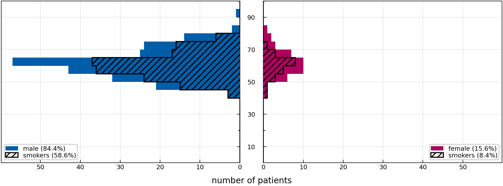
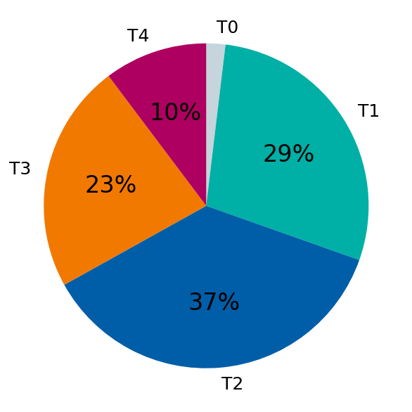
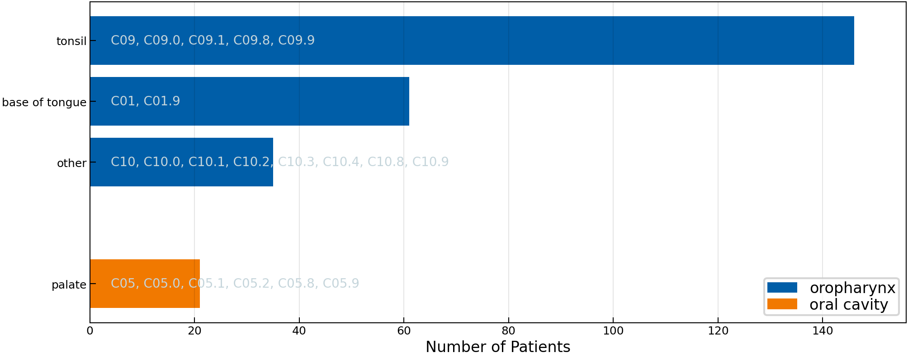

# 2021 CLB Oropharynx

[](https://doi.org/10.1016/j.radonc.2021.01.028)
[](https://doi.org/10.1016/j.dib.2023.110020)
[](https://doi.org/10.5281/zenodo.10204085)

This folder contains the detailed patterns of lymphatic progression of 263 patients with squamous cell carcinomas (SCCs) in the oropharynx, treated at the Centre Léon Bérard (CLB) between 2014 and 2018.


## Table of Contents

- [Cohort Characteristics](#cohort-characteristics)
- [Curation](#curation)
- [Online Interface](#online-interface)
- [Data Description](#data-description)
- [Documentation of Columns](#documentation-of-columns)
- [Raw Data](#raw-data)
- [Mapping Documentation](#mapping)
- [References](#references)


<a id="cohort-characteristics"></a>
## Cohort Characteristics

Below we show some figures that aim to coarsely characterize the patient cohort in this directory.

|                                |
| ---------------------------------------------------------------------------- |
| **Figure 1:** _Distribution over age, stratified by sex and smoking status._ |


|                          |            |
| ---------------------------------------------------------------------------- | -------------------------------------------------------- |
| **Figure 2:** _Distribution over age, stratified by sex and smoking status._ | **Figure 3:** _Distribution over primary tumor subsite._ |


<a id="curation"></a>
## Curation

This is detailed in their publication [[1]](#1) and a we are planning to submit a manuscript describing to the data the *Data in Brief* journal.


<a id="online-interface"></a>
## Online Interface

We provide a user-friendly and intuitive graphical user interface to view the dataset, which is available at https://lyprox.org/. The GUI has two main functionalities: the patient list and the dashboard. The patient list allows for viewing the characteristics of a patient, corresponding to one row of the csv file, in a visually appealing and intuitive way. The dashboard allows for filtering of the dataset. For example, the user may select all patients with primary tumors extending over the mid-sagittal plane with involvement of ipsilateral level III. The dashboard will then display the number or percentage of patients with metastases in each of the other LNLs.


<a id="data-description"></a>
## Data Description

The data is provided as a CSV-table containing one row for each of the 263 patients. The table has a header with three levels that describe the columns. Below we explain each column in the form of a list with three levels. So, for example, list entry 1.i.g refers to a column with the three-level header `patient | # | hpv_status` and underneath it tha patients' HPV status is listed.


<a id="documentation-of-columns"></a>
## Documentation of Columns

1. **`patient:`** General information about the patient’s condition can be found under this top-level header.
    1. **`#:`** The second level under patient has no meaning and exists solely as a filler.
        1. **`id:`** Enumeration of the patients.
        2. **`institution:`** The clinic where the data was extracted.
        3. **`sex:`** The biological sex of the patient.
        4. **`age:`** The age of the patient at the time of diagnosis.
        5. **`diagnose_date:`** Date of diagnosis (format `YYYY-mm-dd`) defined as the date of first histological confirmation of HNSCC.
        6. **`alcohol_abuse:`** `true` for patients who stated that they consume alcohol regularly, `false` otherwise.
        7. **`nicotine_abuse:`** `true` for patients who have been regular smokers (> 10 pack years), `false` otherwise.
        8. **`pack_years:`** Number of pack years of smoking hitory of the patient.
        9. **`hpv_status:`** `true` for patients with human papilloma virus associated tumors (as defined by p16 immunohistochemistry).
        10. **`neck_dissection:`** Indicates whether the patient has received a neck dissection as part of the treatment.
        11. **`tnm_edition:`** The edition of the TNM classification used to classify the patient.
        12. **`n_stage:`** The N category of the patient, indicating the degree of spread to regional lymph nodes.
        13. **`m_stage:`** The M category of the patient, encoding the presence of distant metastases.
2. **`tumor:`** Information about tumors is stored under this top-level header.
    1. **`1:`** The second level enumerates the synchronous tumors. In our database, no patient has had a second tumor but this structure of the file allows us to include such patients in the future. The third-level headers are the same for each tumor..
        1. **`location:`** Anatomic location of the tumor. Since this dataset contains only oropharyngeal SCC patients, this is always `oropharynx`.
        2. **`subsite:`** The subsite of the tumor, specified by ICD-O-3 code.
        3. **`central:`** `true` when the tumor is located centrally on the mid-sagittal plane.
        4. **`extension:`** `true` when the tumor extends over the mid-sagittal plane.
        5. **`volume:`** The volume of the tumor in cm^3.
        6. **`stage_prefix:`** Prefix modifier of the T-category. Can be `“c”` or `“p”`. In this dataset, only the clinically assessed T-category is available.
        7. **`t_stage:`** T-category of the tumor, according to TNM staging.
3. **`diagnostic_consensus:`** This top-level header contains the per-level clinical consensus on lymph node involvement. It was assessed based on different diagnostic modalities like CT or MRI.
    1. **`info:`** The second level header contains general information on the diagnostic consensus.
        1. **`date:`** The date of the diagnostic consensus (same as date of diagnosis).
    2. **`ipsi:`** These columns report the involvement based on the diagnostic consensus for ipsilateral LNLs.
        1. **`II:`** For example, the clinical involvement of level II lymph nodes.
    3. **`contra:`** These columns report the involvement based on the diagnostic consensus for contralateral LNLs.
        1. **`Ib:`** For example, the clinical involvement of sub-level Ib lymph nodes.
4. **`pathology:`** Columns under this header contain pathologically assessed involvement information for each LNL.
    1. **`info:`** The second level header contains general information on the pathology.
        1. **`date:`** The date of the pathology (same as date of diagnosis).
    2. **`ipsi:`** Here, we report the ipsilateral LNL involvement based on the pathology.
        1. **`V:`** For instance, the pathologically assessed involvement of level V lymph nodes.
    3. **`contra:`** The contralateral LNL involvement based on the pathology.
        1. **`II:`** E.g., the pathologically assessed involvement of sub-level II lymph nodes.
5. **`total_dissected:`** The total number of lymph nodes resected per LNL.
    1. **`info:`** The second level header contains general information on the pathology.
        1. **`date:`** The date of the pathology (same as date of diagnosis).
    2. **`ipsi:`** Number of dissected lymph nodes in ipsilateral LNLs.
        1. **`all:`** Like the total number of lymph nodes dissected in all ipsilateral LNLs.
        2. **`IV:`** Or the number of dissected lymph nodes in level IV only.
    3. **`contra:`** Number of dissected lymph nodes in contralateral LNLs.
        1. **`all:`** Consequently, these column contains the total number of lymph nodes dissected in all contralateral LNLs.
        2. **`Ia:`** And this column reports only the number of dissected lymph nodes in level Ia.
6. **`positive_dissected:`** The number of metastatic lymph nodes found in the dissected LNLs.
    1. **`info:`** The second level header contains general information on the pathology.
        1. **`date:`** The date of the pathology (same as date of diagnosis).
    2. **`ipsi:`** Columns under this second-level header report the number of metastatic lymph nodes found in the dissected ipsilateral LNLs.
        1. **`all:`** First, the total number of metastatic lymph nodes found in all ipsilateral LNLs.
        2. **`VII:`** And then, for instance, the number of metastatic lymph nodes found in level VII only.
    3. **`contra:`** Columns under this second-level header report the number of metastatic lymph nodes found in the dissected contralateral LNLs.
        1. **`all:`** In analogy to the ipsilateral LNLs, this column states the total number of metastatic lymph nodes found in all contralateral LNLs.
        2. **`III:`** And this column reports the number of metastatic lymph nodes found in level III only.


<a id="raw-data"></a>
## Raw Data

We also provide the raw data as a CSV file that was used to collect the data in the first place. Because this dataset was collected in France, the columns in the raw data file are in French. Therefore, we provide a legend on some of the columns in the `raw.csv` table:

| Column Name                   | Explanation                                                                                                                                                     |
| :---------------------------- | :-------------------------------------------------------------------------------------------------------------------------------------------------------------- |
| Num patient                   | ID of patient                                                                                                                                                   |
| DDN                           | date of birth: dd/mm/aaaa. :warning: _This column has been deleted for privacy reasons._                                                                        |
| date d'origine                | date of diagnosis: dd/mm/aaaa                                                                                                                                   |
| age                           | age at diagnosis in years                                                                                                                                       |
| sexe                          | sex: 0 (male), 1 (female)                                                                                                                                       |
| PS au diagnostic              | performance status at diagnosis                                                                                                                                 |
| tabagisme                     | smoking status: 0 (never), 1 (former), 2 (active)                                                                                                               |
| tabagisme_PA                  | tabagism in numer of pack years                                                                                                                                 |
| consom.éthylique              | alcohol consumption : 0 (never), 1 (former), 2 (active)                                                                                                         |
| atcd de cancer ORL=>EXCLUSION | history of head and neck cancer: 0 (no), 1 (yes)                                                                                                                |
| atcd de K non ORL             | history of cancer except head and neck                                                                                                                          |
| atcd=                         | localization of past cancer                                                                                                                                     |
| locT_code ICD O3              | diagnosis                                                                                                                                                       |
| latéralité                    | laterality of primary tumor: 0 (lateralized), 1 (median or bilateral)                                                                                           |
| type histo                    | pathological type: 0 (SCC), 1 (basaloid SCC), 2 (sarcomatoid carcinoma)                                                                                         |
| p16                           | p16 status: 0 (-), 1 (+)                                                                                                                                        |
| detailp16                     | how p16 status was determined : 0 (surgery), 1 (biopsy)                                                                                                         |
| risque                        | risk : neg (p16-negative, not concerned), hr (high-risk p16-positive), br (low-risk p16-positive)                                                               |
| traitement T                  | treatment of primary tumor: 0 (no treatment), 1 (surgery), 2 (primary RT), 3 (primary RCT), 4 (surgery and postoperative RT), 5 (surgery and postoperative RCT) |
| traitement N                  | treatment of the neck: 0 (no treatment), 1 (surgery), 2 (primary RT), 3 (primary RCT), 4 (surgery and postoperative RT), 5 (surgery and postoperative RCT)      |
| cT_TNM7                       | clinical T-category according to 7th TNM edition                                                                                                                |
| cN_TNM7                       | clinical N-category according to 7th TNM edition                                                                                                                |
| cT_TNM8                       | clinical T-category according to 8th TNM edition                                                                                                                |
| cN_TNM8                       | clinical N-category according to 8th TNM edition                                                                                                                |
| cM                            | clinical M-category                                                                                                                                             |
| HL_cN+_aireIa                 | is the ipsilateral level Ia clinically or radiologically invaded: 0 (no), 1 (yes)                                                                               |
| HL_cN+_aireIb                 | same for level Ib                                                                                                                                               |
| cN.CL                         | is the contralateral neck clinically or radiologically invaded:  0 (no), 1 (yes)                                                                                |
| CL_cN+_aireIa                 | is the contralateral level Ia clinically or radiologically invaded: 0 (no), 1 (yes)                                                                             |
| curage_coté                   | side of lymph node dissection (LND): 0 (no LND), 1 (ipsilatéral), 2 (bilateral)                                                                                 |
| CUR_type                      | Robins type of LND: 0 (hyperselective), 1 (selective), 2 (modified radical), 3 (radical), 4 (extended radical)                                                  |
| CUR_obj                       | purpose of LND: 1 (preventive), 2 (curative)                                                                                                                    |
| HL_Ia_analysés                | number of node dissected in ipsilateral level Ia                                                                                                                |
| HL_Ia_(+)                     | number of node pathologically invaded in ipsilateral level Ia                                                                                                   |
| total gg analysés HL          | number of node dissected in ipsilateral neck                                                                                                                    |
| total gg (+) HL               | number of node invaded in ipsilateral neck                                                                                                                      |
| RC+                           | extracapsular extension: 0 (no), 1 (yes)                                                                                                                        |
| taille N max                  | maximal size of invaded node in ipsilateral neck in mm                                                                                                          |
| CUR_type2                     | type of LND in contralateral neck                                                                                                                               |
| CUR_obj3                      | cf ipsilateral neck                                                                                                                                             |
| taille N max5                 | #                                                                                                                                                               |
| total gg analysés             | number of nodes dissected in total (ipsi- and contralateral neck)                                                                                               |
| total gg (+)                  | number of nodes found to be metastatic in total (ipsi- and contralateral)                                                                                       |
| RC+6                          | #                                                                                                                                                               |
| taille N max7                 | #                                                                                                                                                               |
| pT_TNM7                       | pathological T-category according to 7th TNM edition                                                                                                            |
| pN_TNM7                       | pathological N-category according to 7th TNM edition                                                                                                            |
| pT_TNM8                       | pathological T-category according to 8th TNM edition                                                                                                            |
| pN_TNM8                       | pathological N-category according to 8th TNM edition                                                                                                            |
| date de sortie                | date of last information about the patient                                                                                                                      |
| follow up                     | follow up in months                                                                                                                                             |
| récidive                      | recurrence: 0 (no), 1 (yes)                                                                                                                                     |
| 2e loc VADS                   | second cancer in head and neck : 0 (no), 1 (yes)                                                                                                                |
| récidive/prog_T               | recurrence or progression on the T: 0 (no), 1 (no)                                                                                                              |
| récidive_N                    | nodal recurrence or progression: 0 (no), 1 (no)                                                                                                                 |
| récidive_M                    | metastatic recurrence or progression: 0 (no), 1 (no)                                                                                                            |
| vie / mort                    | 0 (alive), 1 (dead) at last information                                                                                                                         |
| décès                         | if dead: related (1), or not (0) to the oropharyngeal cancer                                                                                                    |
| REC_date                      | date of recurrence if concerned                                                                                                                                 |
| REC_delai                     | time to recurrence if concerned, in months                                                                                                                      |
| infield/outfield RTE          | localization of recurrence: 0 (out-field), 1 (in-field of radiotherapy), 2 (other)                                                                              |

---

<a id="mapping"></a>

## <kbd>module</kbd> `mapping`
Map the `raw.csv` data from the 2021-clb-oropharynx cohort to the `data.csv` file. 

This module defines how the command `lyscripts data lyproxify` (see [here](rmnldwg.github.io/lyscripts) for the documentation of the `lyscripts` module) should handle the `raw.csv` data that was extracted at the Inselspital Bern in order to transform it into a [LyProX](https://lyprox.org)-compatible `data.csv` file. 

The most important definitions in here are the list `EXCLUDE` and the dictionary `COLUMN_MAP` that defines how to construct the new columns based on the `raw.csv` data. They are described in more detail below: 


--- 

### <kbd>global</kbd> `EXCLUDE` 

List of tuples specifying which function to run for which columns to find out if patients/rows should be excluded in the lyproxified `data.csv`. 

The first element of each tuple is the flattened multi-index column name, the second element is the function to run on the column to determine if a patient/row should be excluded: 

```python
EXCLUDE = [
     (column_name, check_function),
]
``` 

Essentially, a row is excluded, if for that row `check_function(raw_data[column_name])` evaluates to `True`. 

More information can be found in the [documentation](https://rmnldwg.github.io/lyscripts/lyscripts/data/lyproxify.html#exclude_patients) of the `lyproxify` function. 


--- 

### <kbd>global</kbd> `COLUMN_MAP` 

This is the actual mapping dictionary that describes how to transform the `raw.csv` table into the `data.csv` table that can be fed into and understood by [LyProX](https://lyprox.org). 

See [here](https://rmnldwg.github.io/lyscripts/lyscripts/data/lyproxify.html#transform_to_lyprox) for details on how this dictionary is used by the `lyproxify` script. 

It contains a tree-like structure that is human-readable and mimics the tree of multi-level headers in the final `data.csv` file. For every column in the final `data.csv` file, the dictionary describes from which columns in the `raw.csv` file the data should be extracted and what function should be applied to it. 

It also contains a `__doc__` key for every sub-dictionary that describes what the respective column is about. This is used to generate the documentation for the `README.md` file of this data. 


--- 

**Global Variables**
---------------
- **EXCLUDE**
- **COLUMN_MAP**

---

### <kbd>function</kbd> `robust_date`

```python
robust_date(entry, *_args, **_kwargs)
```

Robustly parse a date string. 


---

### <kbd>function</kbd> `robust_int`

```python
robust_int(entry, *_args, **_kwargs)
```

Robustly convert a string to int, if possible. 


---

### <kbd>function</kbd> `get_subsite`

```python
get_subsite(entry, *_args, **_kwargs)
```

Get human-readable subsite from ICD-10 code. 


---

### <kbd>function</kbd> `parse_pathology`

```python
parse_pathology(entry, *_args, **_kwargs)
```

Transform number of positive nodes to `True`, `False` or `None`. 


---

### <kbd>function</kbd> `strip_letters`

```python
strip_letters(entry, *_args, **_kwargs)
```

Remove letters following a number. 


## References

<a id="1">[1]</a>
L. Bauwens *et al*, "Prevalence and distribution of cervical lymph node metastases in HPV-positive and HPV-negative oropharyngeal squamous cell carcinoma", Radiotherapy & Oncology, 2021, DOI: [10.1016/j.radonc.2021.01.028](https://doi.org/10.1016/j.radonc.2021.01.028)

<a id="2">[2]</a>
J. D. Brierley, M. K. Gospodarowicz, and C. Wittekind, 
"TNM Classification of Malignant Tumours." 
John Wiley & Sons, 2017.

<a id="3">[3]</a>
World Health Organization, Ed., 
"International statistical classification of diseases and related health problems, 10th revision, 2nd edition." 
Geneva: World Health Organization, 2004.

<a id="4">[4]</a>
A. G. Fritz, Ed., 
"International classification of diseases for oncology: ICD-O, 3rd ed." 
Geneva: World Health Organization, 2000.