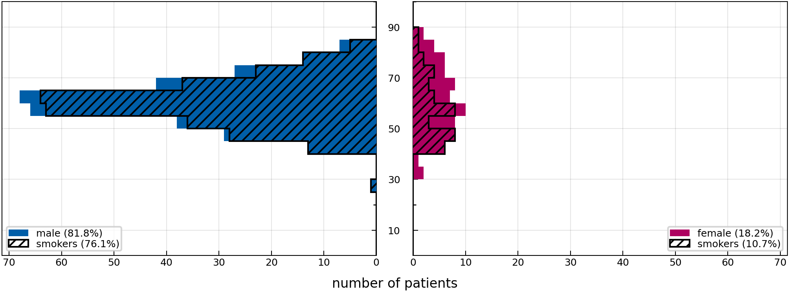
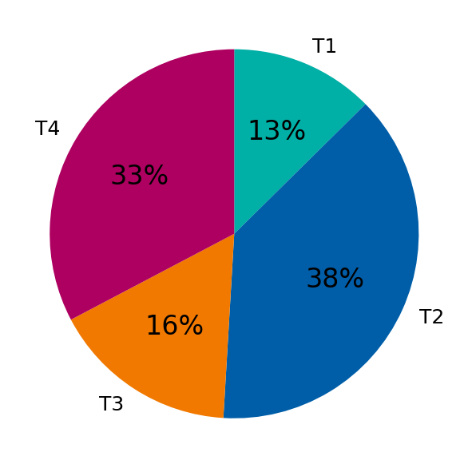
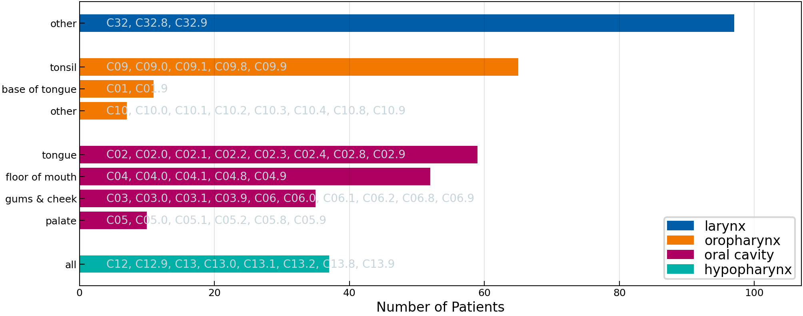

# 2023 CLB Multisite

[](https://doi.org/10.1016/j.dib.2023.110020)
[](https://doi.org/10.5281/zenodo.10210361)

This folder contains the pathology report data on lymphatic involvement in 373 patients with head and neck cancer, diagnosed and treated with neck dissection at the [Centre Léon Bérard] between 2001 and 2018.

The `raw.csv` data does contain patients which are duplicates of the patient records in the `2021-clb-oropharynx` folder, but they have been filtered out in the `data.csv` file.

[Centre Léon Bérard]: https://www.centreleonberard.fr/en

## Table of Contents

- [Cohort Characteristics](#cohort-characteristics)
- [Curation](#curation)
- [Online Interface](#online-interface)
- [Data Description](#data-description)
- [Documentation of Columns](#documentation-of-columns)
- [Mapping Documentation](#mapping)

<a id="cohort-characteristics"></a>

## Cohort Characteristics

Below we show some figures that aim to coarsely characterize the patient cohort in this directory.

|                                |
| ---------------------------------------------------------------------------- |
| **Figure 1:** _Distribution over age, stratified by sex and smoking status._ |

|                          |            |
| ---------------------------------------------------------------------------- | -------------------------------------------------------- |
| **Figure 2:** _Distribution over age, stratified by sex and smoking status._ | **Figure 3:** _Distribution over primary tumor subsite._ |

<a id="curation"></a>

## Curation

Curation and inclusion criteria will be published in a separate _Data in Brief_ article that is currently under review.

<a id="online-interface"></a>

## Online Interface

We provide a user-friendly and intuitive graphical user interface to view the dataset, which is available at <https://lyprox.org/>. The GUI has two main functionalities: the patient list and the dashboard. The patient list allows for viewing the characteristics of a patient, corresponding to one row of the csv file, in a visually appealing and intuitive way. The dashboard allows for filtering of the dataset. For example, the user may select all patients with primary tumors extending over the mid-sagittal plane with involvement of ipsilateral level III. The dashboard will then display the number or percentage of patients with metastases in each of the other LNLs.

<a id="data-description"></a>

## Data Description

The data is provided as a CSV-table containing one row for each of the 373 patients. The table has a header with three levels that describe the columns. Below we explain each column in the form of a list with three levels. So, for example, list entry 1.i.g refers to a column with the three-level header `patient | # | alcohol_abuse` and underneath it we report each patient's history of alcohol abuse.

<a id="documentation-of-columns"></a>

## Documentation of Columns

1. **`patient:`** This top-level header contains general patient information.
    1. **`#:`** The second level header for the `patient` columns is only a placeholder.
        1. **`institution:`** The institution where the patient was treated.
        2. **`sex:`** The biological sex of the patient.
        3. **`age:`** The age of the patient at the time of diagnosis.
        4. **`weight:`** The weight of the patient at the time of diagnosis.
        5. **`diagnose_date:`** The date of surgery because the raw file does not specify a date of diagnosis.
        6. **`alcohol_abuse:`** Whether the patient was abusingly drinking alcohol at the time of diagnosis.
        7. **`nicotine_abuse:`** Whether the patient was smoking nicotine at the time of diagnosis.
        8. **`hpv_status:`** The HPV p16 status of the patient.
        9. **`neck_dissection:`** Whether the patient underwent a neck dissection. In this dataset, all patients underwent a neck dissection.
        10. **`tnm_edition:`** The edition of the TNM classification used.
        11. **`n_stage:`** The pN category of the patient (pathologically assessed).
        12. **`m_stage:`** The M category of the patient. `-1` refers to `'X'`.
        13. **`extracapsular:`** Whether the patient had extracapsular spread. In this dataset, this information is only globally available, not for each individual lymph node level.
2. **`tumor:`** This top-level header contains general tumor information.
    1. **`1:`** The second level header enumerates synchronous tumors.
        1. **`location:`** The location of the tumor. This is empty for all patients because we can later infer it from the subsite's ICD-O-3 code.
        2. **`subsite:`** The subsite of the tumor, specified by ICD-O-3 code.
        3. **`central:`** Whether the tumor is located centrally w.r.t. the mid-sagittal plane.
        4. **`extension:`** Whether the tumor extended over the mid-sagittal line.
        5. **`volume:`** The volume of the tumor in cm^3.
        6. **`stage_prefix:`** The prefix of the T category.
        7. **`t_stage:`** The T category of the tumor.
3. **`pathology:`** This top-level header contains information from the pathology that received the LNLs resected during the neck dissection.
    1. **`info:`** This second-level header contains general information.
        1. **`date:`** The date of the pathology report (same as surgery).
    2. **`ipsi:`** This reports the involvement of the ipsilateral LNLs.
        1. **`III:`** For example, this column reports the involvement of the ipsilateral LNL III.
    3. **`contra:`** This reports the involvement of the contralateral LNLs.
        1. **`V:`** This column reports the pathologic involvement of the contralateral LNL V.
4. **`diagnostic_consensus:`** This top-level header contains information about the diagnostic consensus, which we assumed to be negative for each LNL that was not resected during the neck dissection. However, we do not know if it was positive for resected patients. This means, all columns under this top-level header are essentially inferred from looking at missing entries under the pathology columns.
    1. **`info:`** This second-level header contains general information.
        1. **`date:`** The date of the diagnostic consensus (same as surgery).
    2. **`ipsi:`** This reports the diagnostic consensus of the ipsilateral LNLs.
        1. **`Ib:`** E.g., this column reports the diagnostic consensus of the ipsilateral LNL Ib.
    3. **`contra:`** This reports the diagnostic consensus of the contralateral LNLs.
        1. **`III:`** Under this column, we report the diagnostic consensus of the contralateral LNL III.
5. **`total_dissected:`** This top-level header contains information about the total number of dissected and pathologically investigated lymph nodes per LNL.
    1. **`info:`** This second-level header contains general information.
        1. **`date:`** The date of the neck dissection.
    2. **`ipsi:`** This reports the total number of dissected lymph nodes per ipsilateral LNL.
        1. **`II:`** For instance, this column reports the total number of dissected lymph nodes in ipsilateral LNL II.
        2. **`Ib_to_III:`** This column reports the total number of dissected lymph nodes in ipsilateral LNL Ib to III. This column exists for convenience because we created a figure based on this.
    3. **`contra:`** This reports the total number of dissected lymph nodes per contralateral LNL.
        1. **`VII:`** While this column reports the total number of dissected lymph nodes in contralateral LNL VII.
        2. **`Ib_to_III:`** This column reports the total number of dissected lymph nodes in contralateral LNL Ib to III. This column exists for convenience because we created a figure based on this.
6. **`positive_dissected:`** This top-level header contains information about the number of dissected lymph nodes per LNL that were pathologically found to be positive.
    1. **`info:`** This second-level header contains general information.
        1. **`date:`** The date of the neck dissection.
    2. **`ipsi:`** This reports the number of dissected lymph nodes per ipsilateral LNL that were pathologically found to be positive.
        1. **`IV:`** Here, we report the number of metastatic lymph nodes in ipsilateral LNL IV.
        2. **`Ib_to_III:`** This column reports the number of metastatic dissected lymph nodes in ipsilateral LNL Ib to III. This column exists for convenience because we created a figure based on this.
    3. **`contra:`** This reports the number of dissected lymph nodes per contralateral LNL that were pathologically found to be positive.
        1. **`Ia:`** And this column reports the number of metastatic lymph nodes in contralateral LNL Ia.
        2. **`Ib_to_III:`** This column reports the number of metastatic dissected lymph nodes in contralateral LNL Ib to III. This column exists for convenience because we created a figure based on this.

---

<a id="mapping"></a>

## <kbd>module</kbd> `mapping`

Map the `raw.csv` data from the 2023-clb-multisite cohort to the `data.csv` file.

This module defines how the command `lyscripts data lyproxify` (see [here](rmnldwg.github.io/lyscripts) for the documentation of the `lyscripts` module) should handle the `raw.csv` data that was extracted at the Centre Léon Bérard in order to transform it into a [LyProX](https://lyprox.org)-compatible `data.csv` file.

The most important definitions in here are the list `EXCLUDE` and the dictionary `COLUMN_MAP` that defines how to construct the new columns based on the `raw.csv` data. They are described in more detail below:

---

### <kbd>global</kbd> `EXCLUDE`

List of tuples specifying which function to run for which columns to find out if patients/rows should be excluded in the lyproxified `data.csv`.

The first element of each tuple is the flattened multi-index column name, the second element is the function to run on the column to determine if a patient/row should be excluded:

```python
EXCLUDE = [
     (column_name, check_function),
]
```

Essentially, a row is excluded, if for that row `check_function(raw_data[column_name])` evaluates to `True`.

More information can be found in the [documentation](https://rmnldwg.github.io/lyscripts/lyscripts/data/lyproxify.html#exclude_patients) of the `lyproxify` function.

---

### <kbd>global</kbd> `COLUMN_MAP`

This is the actual mapping dictionary that describes how to transform the `raw.csv` table into the `data.csv` table that can be fed into and understood by [LyProX](https://lyprox.org).

See [here](https://rmnldwg.github.io/lyscripts/lyscripts/data/lyproxify.html#transform_to_lyprox) for details on how this dictionary is used by the `lyproxify` script.

It contains a tree-like structure that is human-readable and mimics the tree of multi-level headers in the final `data.csv` file. For every column in the final `data.csv` file, the dictionary describes from which columns in the `raw.csv` file the data should be extracted and what function should be applied to it.

It also contains a `__doc__` key for every sub-dictionary that describes what the respective column is about. This is used to generate the documentation for the `README.md` file of this data.

---

**Global Variables**
---------------

- **TNM_COLS**
- **IB_TO_III_DISSECTED**
- **EXCLUDE**
- **COLUMN_MAP**

---

### <kbd>function</kbd> `smpl_date`

```python
smpl_date(entry: str) → str
```

Parse date from string.

---

### <kbd>function</kbd> `smpl_diagnose`

```python
smpl_diagnose(entry: str | int, *_args, **_kwargs) → bool
```

Parse the diagnosis.

---

### <kbd>function</kbd> `robust`

```python
robust(func: collections.abc.Callable) → Optional[Any]
```

Return 'robust' type-conversion function.

Do so by simply returning `None` whenever any exception is thrown.

---

### <kbd>function</kbd> `get_subsite`

```python
get_subsite(entry: str, *_args, **_kwargs) → str | None
```

Get human-readable subsite from ICD-10 code.

---

### <kbd>function</kbd> `parse_pathology`

```python
parse_pathology(entry, *_args, **_kwargs) → bool | None
```

Transform number of positive nodes to `True`, `False` or `None`.

---

### <kbd>function</kbd> `set_diagnostic_consensus`

```python
set_diagnostic_consensus(entry, *_args, **_kwargs)
```

Return `False` (i.e. 'healthy') when nothing about a resected LNL is available.

This is a hack to tackle the issue described here: <https://github.com/rmnldwg/lyprox/issues/92>

---

### <kbd>function</kbd> `extract_hpv`

```python
extract_hpv(value: int | None, *_args, **_kwargs) → bool | None
```

Translate the HPV value to a boolean.

---

### <kbd>function</kbd> `strip_letters`

```python
strip_letters(entry: str, *_args, **_kwargs) → int
```

Remove letters following a number.

---

### <kbd>function</kbd> `clean_cat`

```python
clean_cat(cat: str) → int
```

Extract T or N category as integer from the respective string.

I.e., turn 'pN2+' into 2.

---

### <kbd>function</kbd> `get_tnm_info`

```python
get_tnm_info(ct7, cn7, pt7, pn7, ct8, cn8, pt8, pn8) → tuple[int, int, int, str]
```

Determine the TNM edition used.

---

### <kbd>function</kbd> `get_t_category`

```python
get_t_category(*args, **_kwargs) → int
```

Extract the T-category.

---

### <kbd>function</kbd> `get_n_category`

```python
get_n_category(*args, **_kwargs) → int
```

Extract the N-category.

---

### <kbd>function</kbd> `get_tnm_version`

```python
get_tnm_version(*args, **_kwargs) → int
```

Extract the TNM version.

---

### <kbd>function</kbd> `get_tnm_prefix`

```python
get_tnm_prefix(*args, **_kwargs) → str
```

Extract the TNM prefix.

---

### <kbd>function</kbd> `check_excluded`

```python
check_excluded(column: pandas.core.series.Series) → Index
```

Check if a patient/row is excluded based on the content of a `column`.

For the 2022 CLB multisite dataset this is the case when the first column with the three-level header `("Bauwens", "Database", "0_lvl_2")` is not empty or does not contain the character `'n'`.

---

### <kbd>function</kbd> `sum_columns`

```python
sum_columns(*columns, **_kwargs) → int
```

Sum the values of multiple columns.
