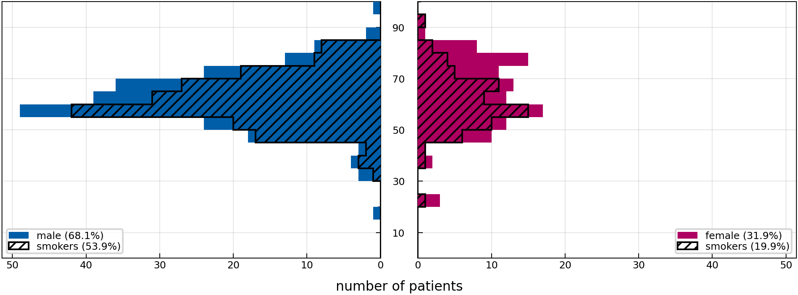
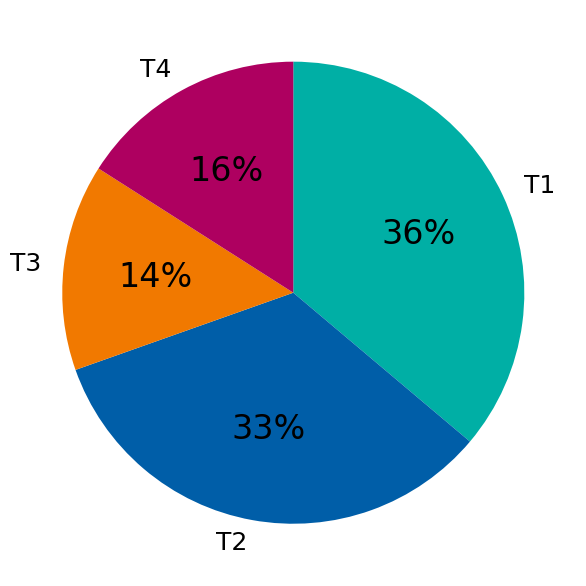
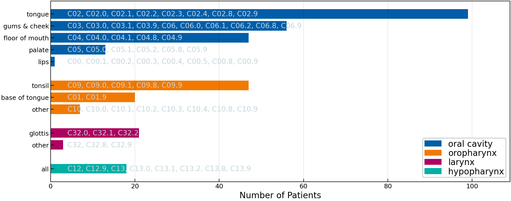

# 2023 ISB Multisite

[](https://doi.org/10.5281/zenodo.10210423)

> [!WARNING]
> The dataset in the form presented here has not yet been published in a peer-reviewed journal. It has, however, been submitted to *Data in Brief* and parts of it are analyzed n another work. Until these papers have been accepted, this dataset may still change.

This folder contains data about clinically and pathologically diagnosed lymphatic patterns of progression from 332 patients treated at the [Inselspital Bern] between 2001 and 2018.

[Inselspital Bern]: https://www.insel.ch/de/


## Table of Contents

- [Cohort Characteristics](#cohort-characteristics)
- [Online Interface](#online-interface)
- [Curation](#curation)
- [Data Description](#data-description)
- [Documentation of Columns](#documentation-of-columns)
- [Mapping Documentation](#mapping)


<a id="cohort-characteristics"></a>
## Cohort Characteristics

Below we show some figures that aim to coarsely characterize the patient cohort in this directory.

|                                |
| ---------------------------------------------------------------------------- |
| **Figure 1:** _Distribution over age, stratified by sex and smoking status._ |


|                          |            |
| ---------------------------------------------------------------------------- | -------------------------------------------------------- |
| **Figure 2:** _Distribution over age, stratified by sex and smoking status._ | **Figure 3:** _Distribution over primary tumor subsite._ |


<a id="online-interface"></a>
## Online Interface

We provide a user-friendly and intuitive graphical user interface to view the dataset, which is available at https://lyprox.org/. The GUI has two main functionalities: the patient list and the dashboard. The patient list allows for viewing the characteristics of a patient, corresponding to one row of the csv file, in a visually appealing and intuitive way. The dashboard allows for filtering of the dataset. For example, the user may select all patients with primary tumors extending over the mid-sagittal plane with involvement of ipsilateral level III. The dashboard will then display the number or percentage of patients with metastases in each of the other LNLs.


<a id="curation"></a>
## Curation

Curation and inclusion criteria will be published in a separate *Data in Brief* article that is currently under review.


<a id="data-description"></a>
## Data Description

The data is provided as a CSV-table containing one row for each of the 332 patients. The table has a header with three levels that describe the columns. Below we explain each column in the form of a list with three levels. So, for example, list entry 1.i.g refers to a column with the three-level header `patient | # | nicotine_abuse` and this column reports about the patient's smoking status.


<a id="documentation-of-columns"></a>
## Documentation of Columns

1. **`patient:`** This top-level header contains general patient information.
    1. **`#:`** The second level header for the `patient` columns is only a placeholder.
        1. **`id:`** The local study ID.
        2. **`institution:`** The institution where the patient was treated.
        3. **`sex:`** The biological sex of the patient.
        4. **`age:`** The age of the patient at the time of diagnosis.
        5. **`diagnose_date:`** The date of diagnosis.
        6. **`alcohol_abuse:`** Whether the patient was abusingly drinking alcohol at the time of diagnosis.
        7. **`nicotine_abuse:`** Whether the patient was considered a smoker. This is set to `False`, when the patient had zero pack-years
        8. **`hpv_status:`** The HPV p16 status of the patient.
        9. **`neck_dissection:`** Whether the patient underwent a neck dissection. In this dataset, all patients underwent a neck dissection.
        10. **`tnm_edition:`** The edition of the TNM classification used.
        11. **`n_stage:`** The pN category of the patient (pathologically assessed).
        12. **`m_stage:`** The M category of the patient.
        13. **`extracapsular:`** Whether the patient had extracapsular spread in any LNL.
2. **`tumor:`** This top-level header contains general tumor information.
    1. **`1:`** This second-level header enumerates synchronous tumors.
        1. **`location:`** The location of the tumor.
        2. **`subsite:`** The subsite of the tumor, specified by ICD-O-3 code.
        3. **`side:`** Whether the tumor occurred on the right or left side of the mid-sagittal plane.
        4. **`central:`** Whether the tumor was located centrally or not.
        5. **`extension:`** Whether the tumor extended over the mid-sagittal line.
        6. **`volume:`** The volume of the tumor in cm^3.
        7. **`stage_prefix:`** The prefix of the T category.
        8. **`t_stage:`** The T category of the tumor.
3. **`CT:`** This top-level header contains involvement information from the CT scan.
    1. **`info:`** This second-level header contains general information about the CT scan.
        1. **`date:`** The date of the CT scan.
    2. **`left:`** This describes the observed involvement of the left LNLs.
        1. **`Va:`** As an example, this describes the clinical involvement of the left LNL Va, as observed in a CT scan.
    3. **`right:`** This describes the observed involvement of the right LNLs.
        1. **`IIa:`** While this describes the clinical involvement of the right LNL IIa, as observed in a CT scan.
4. **`MRI:`** This top-level header contains involvement information from the MRI scan.
    1. **`info:`** This second-level header contains general information about the MRI scan.
        1. **`date:`** The date of the MRI scan.
    2. **`left:`** This describes the observed involvement of the left LNLs.
        1. **`Ia:`** E.g., this describes the clinical involvement of the left LNL Ia, as observed in an MRI scan.
    3. **`right:`** This describes the observed involvement of the right LNLs.
        1. **`III:`** This describes the clinical involvement of the right LNL III, as observed in an MRI scan.
5. **`PET:`** This top-level header contains involvement information from the PET scan.
    1. **`info:`** This second-level header contains general information about the PET scan.
        1. **`date:`** The date of the PET scan.
    2. **`left:`** This describes the observed involvement of the left LNLs.
        1. **`IV:`** For instance, this describes the clinical involvement of the left LNL IV, as observed in a PET scan.
    3. **`right:`** This describes the observed involvement of the right LNLs.
        1. **`III:`** On the other side, this describes the clinical involvement of the right LNL III, as observed in a PET scan.
6. **`pathology:`** This top-level header contains involvement information from the pathology report.
    1. **`info:`** This second-level header contains general information about the pathology report.
        1. **`date:`** Date of the neck dissection.
    2. **`left:`** Microscopic involvement of the left LNLs.
        1. **`I:`** This describes whether the left LNL I was pathologically involved or not.
    3. **`right:`** Microscopic involvement of the right LNLs.
        1. **`IIb:`** This describes whether the right sub-LNL IIb was pathologically involved or not.
7. **`total_dissected:`** This top-level header contains information about the number of lymph nodes dissected in each LNL.
    1. **`info:`** This second-level header contains general information about the pathology report.
        1. **`date:`** Date of the neck dissection.
        2. **`all_lnls:`** The total number of investigated lymph nodes.
    2. **`left:`** Number of dissected lymph nodes per LNL on the left side.
        1. **`Va:`** Number of dissected lymph nodes in the left sub-LNL Va.
        2. **`Ib_to_III:`** Total number of dissected lymph nodes in the left LNLs Ib-III. This information is gathered for a particular figure in our publication. Note that this is not just the sum of the dissected nodes in the LNLs Ib to III because some levels were resected en-bloc. Those are included in this column but could not be resolved for the individual LNLs.
    3. **`right:`** Number of dissected lymph nodes per LNL on the right side.
        1. **`II:`** Total number of dissected lymph nodes in the right LNL II.
        2. **`Ib_to_III:`** Total number of dissected lymph nodes in the right LNLs Ib-III. This information is gathered for a particular figure in our publication. Note that this is not just the sum of the dissected nodes in the LNLs Ib to III because some levels were resected en-bloc. Those are included in this column but could not be resolved for the individual LNLs.
8. **`positive_dissected:`** This top-level header contains information about the number of pathologically positive lymph nodes in each LNL.
    1. **`info:`** This second-level header contains general information about the findings of metastasis by the pathologist.
        1. **`date:`** Date of the neck dissection.
        2. **`all_lnls:`** The total number of involved lymph nodes.
        3. **`largest_node_mm:`** Size of the largest lymph node in the neck dissection in mm.
        4. **`largest_node_lnl:`** LNL where the largest pathological lymph node metastasis was found.
    2. **`left:`** Number of pathologically positive lymph nodes per LNL on the left side.
        1. **`V:`** Total number of pathologically positive lymph nodes in the left LNL V.
        2. **`Ib_to_III:`** Total number of dissected lymph nodes found to harbor metastases in the left LNLs Ib-III. This information is gathered for a particular figure in our publication. Note that this is not just the sum of the dissected nodes in the LNLs Ib to III because some levels were resected en-bloc. Those are included in this column but could not be resolved for the individual LNLs.
    3. **`right:`** Number of pathologically positive lymph nodes per LNL on the right side.
        1. **`IIa:`** Total number of pathologically positive lymph nodes in the right sub-LNL IIa.
        2. **`Ib_to_III:`** Total number of dissected lymph nodes found to harbor metastases in the right LNLs Ib-III. This information is gathered for a particular figure in our publication. Note that this is not just the sum of the dissected nodes in the LNLs Ib to III because some levels were resected en-bloc. Those are included in this column but could not be resolved for the individual LNLs.
9. **`enbloc_dissected:`** These columns only report the number of lymph nodes that where resected en-bloc. If, e.g., the LNLs II, III, and IV were resected together, then in each of the respective columns, we report the total number of jointly resected lymph nodes and add a symbol - e.g. 'a' - to identify the en-bloc resection.
    1. **`left:`** This reports the en-bloc resection of the left LNLs.
    2. **`right:`** This reports the en-bloc resection of the right LNLs.
10. **`enbloc_positive:`** These columns only report the number of positive lymph nodes that where resected en-bloc. If, e.g., the LNLs II, III, and IV were resected together, then in each of the respective columns, we report the number of jointly resected lymph nodes that were found to harbor metastases and add a symbol - e.g. 'a' - to identify the en-bloc resection.
    1. **`left:`** For each LNL, this reports the number of en-bloc resected and positive lymph nodes on the left side.
    2. **`right:`** For each LNL, this reports the number of en-bloc resected and positive lymph nodes on the right side.


---


<a id="mapping"></a>

## <kbd>module</kbd> `mapping`
Map the `raw.csv` data from the 2023-isb-multisite cohort to the `data.csv` file. 

This module defines how the command `lyscripts data lyproxify` (see [here](rmnldwg.github.io/lyscripts) for the documentation of the `lyscripts` module) should handle the `raw.csv` data that was extracted at the Inselspital Bern in order to transform it into a [LyProX](https://lyprox.org)-compatible `data.csv` file. 

The most important definitions in here are the list `EXCLUDE` and the dictionary `COLUMN_MAP` that defines how to construct the new columns based on the `raw.csv` data. They are described in more detail below: 


--- 

### <kbd>global</kbd> `EXCLUDE` 

List of tuples specifying which function to run for which columns to find out if patients/rows should be excluded in the lyproxified `data.csv`. 

The first element of each tuple is the flattened multi-index column name, the second element is the function to run on the column to determine if a patient/row should be excluded: 

```python
EXCLUDE = [
     (column_name, check_function),
]
``` 

Essentially, a row is excluded, if for that row `check_function(raw_data[column_name])` evaluates to `True`. 

More information can be found in the [documentation](https://rmnldwg.github.io/lyscripts/lyscripts/data/lyproxify.html#exclude_patients) of the `lyproxify` function. 


--- 

### <kbd>global</kbd> `COLUMN_MAP` 

This is the actual mapping dictionary that describes how to transform the `raw.csv` table into the `data.csv` table that can be fed into and understood by [LyProX](https://lyprox.org). 

See [here](https://rmnldwg.github.io/lyscripts/lyscripts/data/lyproxify.html#transform_to_lyprox) for details on how this dictionary is used by the `lyproxify` script. 

It contains a tree-like structure that is human-readable and mimics the tree of multi-level headers in the final `data.csv` file. For every column in the final `data.csv` file, the dictionary describes from which columns in the `raw.csv` file the data should be extracted and what function should be applied to it. 

It also contains a `__doc__` key for every sub-dictionary that describes what the respective column is about. This is used to generate the documentation for the `README.md` file of this data. 


--- 

**Global Variables**
---------------
- **MRI_OR_CT_COL**
- **PATHOLOGY_COLS_POSITIVE**
- **PATHOLOGY_COLS_INVESTIGATED**
- **ALL_FALSE**
- **SUBLVL_PATTERN**
- **IB_TO_III_PATTERN**
- **EXCLUDE**
- **COLUMN_MAP**

---

### <kbd>function</kbd> `smpl_date`

```python
smpl_date(entry)
```


---

### <kbd>function</kbd> `smpl_diagnose`

```python
smpl_diagnose(entry, *_args, **_kwargs)
```


---

### <kbd>function</kbd> `robust`

```python
robust(func: Callable) → Optional[Any]
```

Wrapper that makes any type-conversion function 'robust' by simply returning `None` whenever any exception is thrown. 


---

### <kbd>function</kbd> `get_subsite`

```python
get_subsite(entry, *_args, **_kwargs) → str | None
```

Get human-readable subsite from ICD-10 code. 


---

### <kbd>function</kbd> `map_to_lnl`

```python
map_to_lnl(entry, tumor_side, *_args, **_kwargs) → list[str] | None
```

Map integers representing the location of the largest LN to the correct LNL. 


---

### <kbd>function</kbd> `has_pathological_t`

```python
has_pathological_t(entry, *_args, **_kwargs) → bool
```

Check whether the pathological T-stage is available. 


---

### <kbd>function</kbd> `map_t_stage`

```python
map_t_stage(clinical, pathological, *_args, **_kwargs) → int | None
```

Map their T-stage encoding to actual T-stages. 

The clinical stage is only used if the pathological stage is not available. 


---

### <kbd>function</kbd> `map_t_stage_prefix`

```python
map_t_stage_prefix(pathological, *_args, **_kwargs) → str | None
```

Determine whether T category was assessed clinically or pathologically. 


---

### <kbd>function</kbd> `map_n_stage`

```python
map_n_stage(entry, *_args, **_kwargs) → int | None
```

Map their N-stage encoding to actual N-stage. 


---

### <kbd>function</kbd> `map_location`

```python
map_location(entry, *_args, **_kwargs) → str | None
```

Map their location encoding to the semantic locations. 


---

### <kbd>function</kbd> `map_side`

```python
map_side(entry, *_args, **_kwargs) → str | None
```

Map their side encoding to the semantic side. 


---

### <kbd>function</kbd> `map_ct`

```python
map_ct(entry, mri_or_ct, *_args, **_kwargs) → bool | None
```

Call `robust(smpl_diagnose)` if the patient has a CT diagnose. 


---

### <kbd>function</kbd> `map_mri`

```python
map_mri(entry, mri_or_ct, *_args, **_kwargs) → bool | None
```

Call `robust(smpl_diagnose)` if the patient has an MRI diagnose. 


---

### <kbd>function</kbd> `from_pathology`

```python
from_pathology(entry) → tuple[dict[str, int], bool]
```

Infer how many nodes in an LNL where investigated/positive per resection. And if the LNL showed signs of extracapsular extension (ECE). 

The way the data was collected is a bit tricky: Generally, they report the number of nodes in an LNL that were investigated or positive (depending on the column one looks at). But if multiple levels were resected and investigated en bloc, they wrote the finding in each LNL and appended a letter to the number. So, if LNL I was resected together with LNL II and they found in total 10 nodes, they would write `LNL I: 10a` and `LNL II: 10a`. 

Additionally, if extracapsular extension was found, they would add 100 to the number. And if parts of an LNL were resected with another LNL but another part of the LNL was investigated on its own, they would write something like `12 + 4b`. 


---

### <kbd>function</kbd> `num_from_pathology`

```python
num_from_pathology(entry, *_args, **_kwargs) → int | None
```

Infer number of involved nodes in LNL from pathology report. 


---

### <kbd>function</kbd> `binary_from_pathology`

```python
binary_from_pathology(entry, *_args, **_kwargs) → bool | None
```

Infer binary involvement from pathology report. 


---

### <kbd>function</kbd> `num_super_from_pathology`

```python
num_super_from_pathology(*lnl_entries, lnl='I', side='left') → int | None
```

Infer number of involved lymph nodes in super LNL (e.g. I, II and V) from pathology. 

This involves checking if other LNLs have been resected with the LNL in question. In that case, we do not know if the LNL in question was involved or if it was only one of the co-resected LNLs. 


---

### <kbd>function</kbd> `get_index`

```python
get_index(side: str, lnl: str) → int
```

For a side of the neck and an LNL, return the index of the LNL in the `PATHOLOGY_COLS_INVESTIGATED` array. 


---

### <kbd>function</kbd> `num_Ib_to_III_from_pathology`

```python
num_Ib_to_III_from_pathology(*lnl_entries, side='left') → int | None
```

Infer number of involved lymph nodes in LNL Ib to III from pathology. 


---

### <kbd>function</kbd> `binary_super_from_pathology`

```python
binary_super_from_pathology(*lnl_entries, lnl='I', side='left') → bool | None
```

Infer if super LNL is involved from pathology. 


---

### <kbd>function</kbd> `enbloc_resected_from_pathology`

```python
enbloc_resected_from_pathology(*lnl_entries) → str | None
```

Return number and symbol of co-resected LNLs. 


---

### <kbd>function</kbd> `map_ece`

```python
map_ece(*lnl_entries, **_kwargs)
```

Infer from the provided columns if the patient had LNL involvement with extra-capsular extension. 

In the data, this is encoded by the value 100 being added to the number of positive LNLs. 


---

### <kbd>function</kbd> `get_ct_date`

```python
get_ct_date(entry, mri_or_ct, *_args, **_kwargs)
```

Determine the date of the CT diagnose. 


---

### <kbd>function</kbd> `get_mri_date`

```python
get_mri_date(entry, mri_or_ct, *_args, **_kwargs)
```

Determine the date of the MRI diagnose. 


