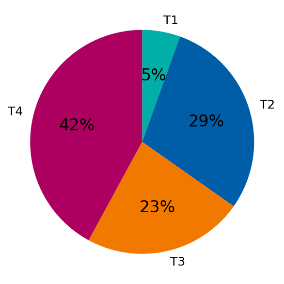
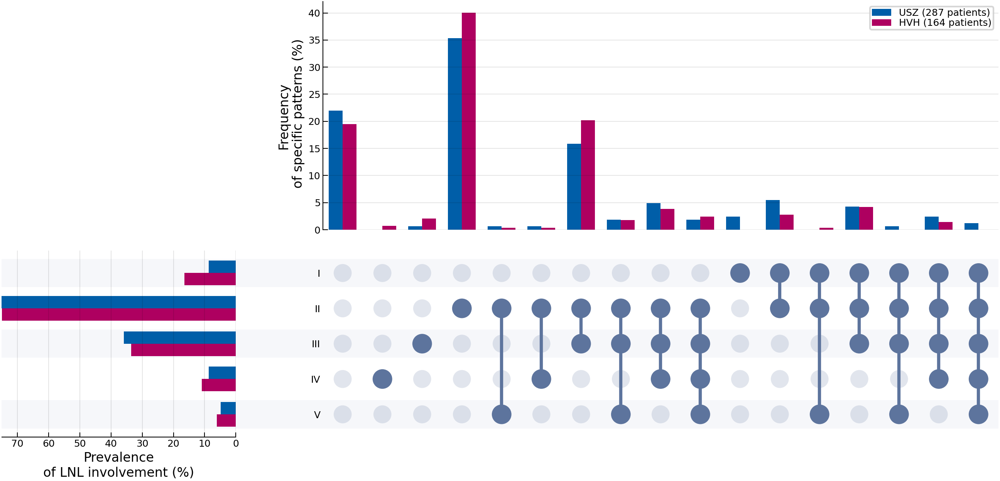

# 2025 HVH Oropharynx

> [!WARNING]
> This dataset has not been published in a peer-reviewed journal yet. Contents may change.

This folder contains the detailed patterns of lymphatic progression of 164 patients with squamous cell carcinomas (SCCs) in the oropharynx, treated at the Hospital Vall d'Hebron between 2007 and 2021.

You can find here

* the data itself as `data.csv`
* a citation file `CITATION.cff` that can be used to cite this dataset.
* the folder `figures` containing some plots of characteristics of the data.

## Cohort Characteristics

Below we show some figures that aim to coarsely characterize the patient cohort in this directory.

|                                  |
| ---------------------------------------------------------------------------- |
| **Figure 1:** _Distribution over age, stratified by sex and smoking status._ |

|                            |              |
| ---------------------------------------------------------------------------- | -------------------------------------------------------- |
| **Figure 2:** _Distribution over age, stratified by sex and smoking status._ | **Figure 3:** _Distribution over primary tumor subsite._ |

|  |
| ----------------------------------------------------------------------------- |
| **Figure 4:** _An "upsetplot" comparing the involvement patterns of the dataset from the USZ and the new data from the HVH. It shows both the prevalence of any LNL's involvement (horizontal bar plot, left), as well as how frequent any specific pattern of involvement was (vertical bar plot, top)._ |

## Description

The data is provided as a CSV-table containing one row for each of the 287 patients. The table has a header with three levels that describe the columns. Below we explain each column in the form of a list with three levels. So, for example, list entry 1.i.g refers to a column with the three-level header `patient | # | hpv_status` and underneath it tha patients' HPV status is listed.

## Columns

1. **`patient:`** General information about the patient’s condition can be found under this top-level header.
    1. **`#:`** The second level under patient has no meaning and exists solely as a filler.
        1. **`id:`** Enumeration of the patients
        2. **`institution:`** The clinic at which the patient were treated and recorded. This holds the value "Vall d'Hebron Barcelona Hospital" for all patients in this dataset.
        3. **`sex:`** Sex of the patient
        4. **`age:`** Patient’s age at diagnosis
        5. **`diagnose_date:`** Date of diagnosis (format `YYYY-mm-dd`) defined as the date of first histological confirmation of HNSCC.
        6. **`alcohol_abuse:`** `true` for patients who stated that they consume alcohol regularly, `false` otherwise
        7. **`nicotine_abuse:`** `true` for patients who have been regular smokers (> 10 pack years)
        8. **`hpv_status:`** `true` for patients with human papilloma virus associated tumors (as defined by p16 immunohistochemistry)
        9. **`neck_dissection:`** Indicates whether the patient has received a neck dissection as part of the treatment.
        10. **`tnm_edition:`** The edition of the TNM classification used to classify the patient [[1]](#1)
        11. **`n_stage:`** Degree of spread to regional lymph nodes
        12. **`m_stage:`** Presence of distant metastases
2. **`tumor:`** Information about tumors is stored under this top-level header
    1. **`<number>:`** The second level enumerates the synchronous tumors. In our database, no patient has had a second tumor, but this structure of the file allows us to include such patients in the future. The third-level headers are the same for each tumor.
        1. **`location:`** Anatomic location of the tumor
        2. **`subsite:`** ICD-O-3 code associated with a tumor at the particular location according to the world health organization [[2]](#2), [[3]](#3)
        3. **`side:`** Lateralization of the tumor. Can be `“left”` or `“right”` for tumors that have their center of mass clearly on the respective side of the mid-sagittal line and `“central”` for patients with a tumor on the mid-sagittal line.
        4. **`central:`** Whether the tumor is centralized or not.
        5. **`extension:`** True if part of the tumor extends over the mid-sagittal line
        6. **`volume:`** Volume of the tumor in cm3
        7. **`stage_prefix:`** Prefix modifier of the T-category. Can be `“c”` or `“p”`
        8. **`t_stage:`** T-category of the tumor, according to TNM staging
3. **`<diagnostic modality>:`** Each recorded diagnostic modality is indicated by its own top-level header. In this file FNA, CT, MRI, PET, pathology and pCT (planning CT) are provided
    1. **`info:`**
        1. **`date:`** Day on which a diagnose with the respective modality was performed
    2. **`ipsi:`** All findings of involved lymph nodes on the ipsilateral side of the patient’s neck
        1. **`<LNL>:`** One column is provided for each recorded lymph node level. For each level `true` indicates at least one finding diagnosed as malignant lymph node in the respective LNL, `false` means no malignant lymph node has been found and an empty field indicates that no diagnosis is available for this LNL according to the respective diagnostic modality. `<LNL>` can be: I, Ia, Ib, II, IIa, IIb, III, IV, V, VI, VII, VIII, IX, X.
    3. **`contra:`** Same as 3.ii but for the contralateral side of the patient’s neck
        1. **`<LNL>:`** same as under 3.ii.a

## Refernces

<a id="1">[1]</a>
J. D. Brierley, M. K. Gospodarowicz, and C. Wittekind,
"TNM Classification of Malignant Tumours."
John Wiley & Sons, 2017.

<a id="2">[2]</a>
World Health Organization, Ed.,
"International statistical classification of diseases and related health problems, 10th revision, 2nd edition."
Geneva: World Health Organization, 2004.

<a id="3">[3]</a>
A. G. Fritz, Ed.,
"International classification of diseases for oncology: ICD-O, 3rd ed."
Geneva: World Health Organization, 2000.
