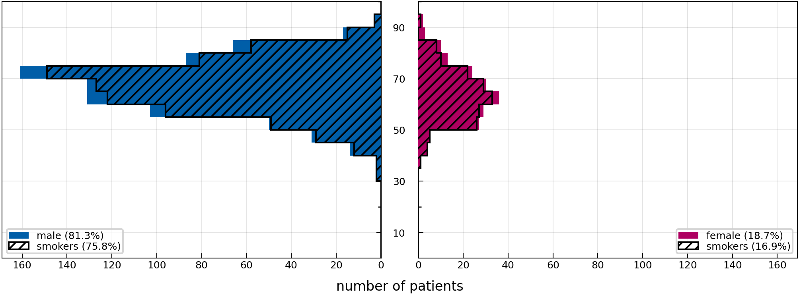
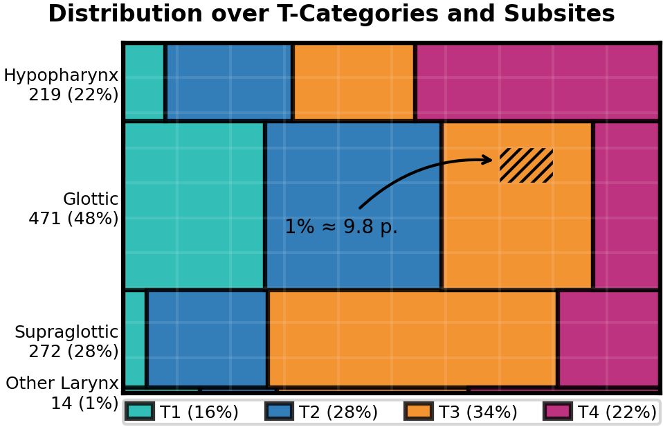

# 2025 UMCG Hypopharynx Larynx

> [!WARNING]
> The dataset in the form presented here has not yet been published in a peer-reviewed journal. It has, however, been submitted to *Data in Brief* and parts of it are analyzed in another work. Until these papers have been accepted, this dataset may still change.

[](https://doi.org/10.5281/zenodo.16962870)

This folder contains data about clinically and pathologically assessed lymphatic patterns of progression from 983 patients treated at the [University Medical Center Groningen] between 2006 and 2023.

[University Medical Center Groningen]: https://www.umcg.nl/

## Table of Contents

- [Cohort Characteristics](#cohort-characteristics)
- [Online Interface](#online-interface)
- [Curation](#curation)
- [Data Description](#data-description)
- [Documentation of Columns](#documentation-of-columns)
- [Mapping Documentation](#mapping)

<a id="cohort-characteristics"></a>

## Cohort Characteristics

Below we show some figures that aim to coarsely characterize the patient cohort in this directory.

|                                  |
| ---------------------------------------------------------------------------- |
| **Figure 1:** *Distribution over age, stratified by sex and smoking status.* |

|           |
| -------------------------------------------------------------------------- |
| **Figure 2:** *Distribution over T-category and subsite as an area chart.* |

<a id="online-interface"></a>

## Online Interface

We provide a user-friendly and intuitive graphical user interface to view the dataset, which is available at <https://lyprox.org/>. The GUI has two main functionalities: the patient list and the dashboard. The patient list allows for viewing the characteristics of a patient, corresponding to one row of the csv file, in a visually appealing and intuitive way. The dashboard allows for filtering of the dataset. For example, the user may select all patients with primary tumors extending over the mid-sagittal plane with involvement of ipsilateral level III. The dashboard will then display the number or percentage of patients with metastases in each of the other LNLs.

<a id="curation"></a>

## Curation

Curation and inclusion criteria will be published in a separate *Data in Brief* article that is currently under review.

<a id="data-description"></a>

## Data Description

The data is provided as a CSV-table containing one row for each of the 983 patients. The table has a header with three levels that describe the columns. Below we explain each column in the form of a list with three levels. So, for example, list entry 1.i.g refers to a column with the three-level header `patient | # | nicotine_abuse` and this column reports about the patient's smoking status.

<a id="documentation-of-columns"></a>

## Documentation of Columns

1. **`patient:`** General information about the patient's condition can be found under this top-level header.
    1. **`core:`** General information about the patient.
        1. **`id:`** A unique patient ID.
        2. **`institution:`** The clinic where the data was extracted.
        3. **`sex:`** The biological sex of the patient.
        4. **`age:`** The age of the patient at the time of diagnosis.
        5. **`diagnose_date:`** Date of diagnosis (format `YYYY-mm-dd`). In case the date of diagnosis was missing, this may also report the date of surgery or the start of radiotherapy.
        6. **`alcohol_abuse:`** `True` for patients who stated that they consume alcohol regularly, `false` otherwise.
        7. **`nicotine_abuse:`** Patients which are current or former smokers.
        8. **`pack_years:`** Number of pack years of smoking history, if available.
        9. **`hpv_status:`** The HPV p16 status of the patient.
        10. **`neck_dissection:`** Indicates whether the patient has received a neck dissection as part of the treatment.
        11. **`tnm_edition:`** The edition of the TNM classification used to classify the patient. In this dataset, only version 7 is used.
        12. **`n_stage:`** The N category of the patient, indicating the degree of spread to regional lymph nodes.
        13. **`m_stage:`** The M category of the patient, encoding the presence of distant metastases.
2. **`tumor:`** Information about tumors is stored under this top-level header.
    1. **`core:`** General information about the tumor.
        1. **`location:`** Anatomic location of the tumor. Since this dataset contains only oropharyngeal SCC patients, this is always `oropharynx`.
        2. **`subsite:`** The subsite of the tumor, specified by ICD-O-3 code.
        3. **`central:`** `true` when the tumor is located centrally on the mid-sagittal plane.
        4. **`extension:`** `true` when the tumor extends over the mid-sagittal plane.
        5. **`volume:`** The volume of the tumor in cm^3. Not reported in this dataset.
        6. **`t_stage_prefix:`** Prefix modifier of the T-category. Can be 'c' or 'p'. In this dataset, only the clinically assessed T-category is available.
        7. **`t_stage:`** T-category of the tumor, according to TNM staging.
        8. **`dist_to_midline:`** Distance of the tumor to the mid-sagittal plane in millimeters.
3. **`diagnostic_consensus:`** This top-level header contains the per-side and per-level clinical consensus on lymph node involvement. It was assessed based on different diagnostic modalities like CT or MRI.
    1. **`core:`** The second level header contains general information on the diagnostic consensus.
        1. **`date:`** The date of the diagnostic consensus (same as date of diagnosis).
    2. **`ipsi:`** These columns report the involvement based on the diagnostic consensus for ipsilateral LNLs.
        1. **`II:`** For example, the clinical involvement of ipsilateral level II lymph nodes.
    3. **`contra:`** These columns report the involvement based on the diagnostic consensus for contralateral LNLs.
        1. **`IV:`** E.g., the clinical involvement of contralateral level IV lymph nodes.
4. **`pathology:`** This top-level header contains information on the pathological assessment of lymph nodes after neck dissection in binary form.
    1. **`core:`** Second level header contains general information on pathology.
        1. **`date:`** The date of the pathological assessment.
    2. **`ipsi:`** Columns reporting pathological involvement for ipsi LNLs.
        1. **`I:`** For instance, the pathological involvement of ipsilateral level I.
    3. **`contra:`** Columns reporting pathological involvement for contra LNLs.
5. **`positive_dissected:`** {'The total number of lymph nodes found to be metastatic in the pathological assessment after neck dissection, reported per LNL level.'}
    1. **`core:`** The second level header contains general information on the total number of nodes found to be positive.
        1. **`date:`** The date of the pathological assessment.
    2. **`ipsi:`** Number of involved lymph nodes for ipsilateral LNLs.
    3. **`contra:`** Number of involved lymph nodes for contralateral LNLs.
        1. **`IV:`** E.g., the number of involved contralateral level IV lymph nodes.
6. **`extracapsular:`** This top-level header contains information on the presence of extracapsular spread (ECS) found in any lymph nodes of an LNL.
    1. **`core:`** The second level header contains general information on ECS.
        1. **`date:`** The date of the pathological assessment of ECE.
    2. **`ipsi:`** These columns report the presence of ECS for ipsilateral LNLs.
        1. **`V:`** If `True`, this indicates the presence of ECS in at least one of the ipsilateral level V lymph nodes.
    3. **`contra:`** These columns report the presence of ECS for contra LNLs.

---

<a id="mapping"></a>

## <kbd>module</kbd> `mapping`

Transform `raw_*.csv` to `data_*.csv`.

This module defines how the command `lyscripts data lyproxify` (see [the documentation](https://lyscripts.readthedocs.io/) for the documentation of the `lyscripts` module) should handle the `raw_*.csv` data that was extracted at the UMCG in order to transform it into a [LyProX](https://lyprox.org)-compatible `data_*.csv` file.

The most important definitions in here are the list `EXCLUDE` and the dictionary `COLUMN_MAP` that defines how to construct the new columns based on the `raw_*.csv` data. They are described in more detail below:

---

### <kbd>global</kbd> `EXCLUDE`

List of tuples specifying which function to run for which columns to find out if patients/rows should be excluded in the lyproxified `data_*.csv`.

The first element of each tuple is the flattened multi-index column name, the second element is the function to run on the column to determine if a patient/row should be excluded:

```python
EXCLUDE = [
     (column_name, check_function),
]
```

Essentially, a row is excluded, if for that row `check_function(raw_data[column_name])` evaluates to `True`.

More information can be found in the [documentation](https://lyscripts.readthedocs.io/latest/data/lyproxify.html#lyscripts.data.lyproxify.exclude_patients) of the `lyproxify` function.

---

### <kbd>global</kbd> `COLUMN_MAP`

This is the actual mapping dictionary that describes how to transform the `raw_*.csv` table into the `data_*.csv` table that can be fed into and understood by [LyProX](https://lyprox.org).

See [the documentation](https://lyscripts.readthedocs.io/latest/data/lyproxify.html#lyscripts.data.lyproxify.transform_to_lyprox) for details on how this dictionary is used by the `lyproxify` script.

It contains a tree-like structure that is human-readable and mimics the tree of multi-level headers in the final `data_*.csv` file. For every column in the final `data_*.csv` file, the dictionary describes from which columns in the `raw_*.csv` file the data should be extracted and what function should be applied to it.

It also contains a `__doc__` key for every sub-dictionary that describes what the respective column is about. This is used to generate the documentation for the `README.md` file of this data.

---

**Global Variables**
---------------

- **EXCLUDE**
- **COLUMN_MAP**

---

### <kbd>function</kbd> `robust_int`

```python
robust_int(entry, *_args, **_kwargs) → int | None
```

Robustly convert a string to int, if possible.

---

### <kbd>function</kbd> `get_age`

```python
get_age(entry, *_args, **_kwargs) → int | None
```

Robustly convert a float string to int, if possible.

---

### <kbd>function</kbd> `robust_bool`

```python
robust_bool(entry, *_args, **_kwargs) → bool | None
```

Robustly convert a string to bool, if possible.

---

### <kbd>function</kbd> `is_smaller_or_nan`

```python
is_smaller_or_nan(entry, threshold, *_args, **_kwargs) → bool
```

Check if a value is smaller than a threshold or NaN.

---

### <kbd>function</kbd> `robust_date`

```python
robust_date(entry, *_args, **_kwargs) → str | None
```

Robustly convert a string to date, if possible.

---

### <kbd>function</kbd> `t_stage_mapping`

```python
t_stage_mapping(*entry, **_kwargs) → str
```

Map the T stage to the TNM edition 7.

---

### <kbd>function</kbd> `t_stage_prefix`

```python
t_stage_prefix(*entry, **_kwargs) → str
```

Map the T stage prefix to the TNM edition 7.

---

### <kbd>function</kbd> `n_stage_mapping`

```python
n_stage_mapping(*entry, **_kwargs) → str
```

Map the N stage to the TNM edition 7.

---

### <kbd>function</kbd> `m_stage_mapping`

```python
m_stage_mapping(*entry, **_kwargs) → str
```

Map the M stage to the TNM edition 7.

---

### <kbd>function</kbd> `had_neck_dissection`

```python
had_neck_dissection(entry, *_args, **_kwargs) → bool | None
```

Check if a patient had a neck dissection.

---

### <kbd>function</kbd> `subsite_mapping`

```python
subsite_mapping(entry, *_args, **_kwargs) → str
```

Map from the numerical value to an ICD code.

---

### <kbd>function</kbd> `location_mapping`

```python
location_mapping(entry, *_args, **_kwargs) → str
```

Map the numerical column value to a primary tumor location.

---

### <kbd>function</kbd> `get_earlier_date`

```python
get_earlier_date(*date_entries, **_kwargs) → str
```

Return the earliest date from a list of dates.

---

### <kbd>function</kbd> `is_dead`

```python
is_dead(entry, *_args, **_kwargs) → bool | None
```

Check if a patient is dead.

---

### <kbd>function</kbd> `cause_of_death`

```python
cause_of_death(entry, *_args, **_kwargs) → str | None
```

Return the cause of death.

---

### <kbd>function</kbd> `had_complication`

```python
had_complication(entry, *_args, **_kwargs) → bool | None
```

Check if a patient had a complication.

---

### <kbd>function</kbd> `safe_recurrence_date`

```python
safe_recurrence_date(rec, date, *_args, **_kwargs) → str | None
```

Return the date of recurrence if the patient had a recurrence.

---

### <kbd>function</kbd> `create_id_counter`

```python
create_id_counter(start: int, prefix: str) → Callable[[], str]
```

Create a func to generates IDs counting from `start` with the given `prefix`.
